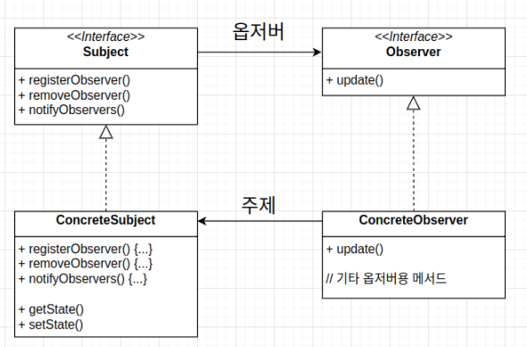

# 옵저버 패턴
## 문제 상황
기상 모니터링 애플리케이션을 개발해야 함!

이를 위해 애플리케이션을 이루는 WeatherData 객체(일부 완성)를 적절히 구현하는 것이 목표

### 애플리케이션의 구조
* 기상 스테이션(실제 기상 정보를 수집하는 물리 장비)
    * 온도 센서
    * 습도 센서
    * 기압 센서
* WeatherData 객체
    * 가장 최근에 측정(갱신)된 온도, 습도, 기압 값을 리턴하는 메서드
        * getTemperature()
        * getHumidity()
        * getPressure()
    * 기상 관측값이 갱신될 때마다 호출되는 메서드
        * measurementsChanged() - 우리가 수정해야 할 부분
    * 기상 스테이션에서 갱신된 정보를 가져오는 행위는 이미 구현된 상황이므로 우리는 몰라도 됨
* 디스플레이 장비
    * 각종 디스플레이 요소(우리가 구현해야 함)
        * 현재 조건
        * 기상 통계
        * 기상 예보
          WeatherData 객체가 기상 스테이션으로부터 데이터를 취득하면 이를 디스플레이 장비로 넘겨 디스플레이에서 표시되는 정보를 업데이트해야 함

## 문제 해결 과정
### 이미 알고 있는 사실 파악(힌트)
1. WeatherData 객체에는 3가지 게터 메서드 존재
2. 새로운 기상 데이터가 측정될 때마다 measurementsChanged() 메서드 호출됨
3. 기상 데이터를 사용하는 디스플레이 요소 3가지를 직접 구현해야 함
   데이터가 업데이트될 때마다 디스플레이를 갱신해야 하므로 measurementsChanged() 내에 디스플레이 업데이트 코드를 추가하는 게 낫지 않을까?

#### 추가 목표: 변화
* 소프트웨어 개발에서 변하지 않는 원칙은 소프트웨어 개발 과정에는 변화가 무조건 존재한다는 것
* 사용자 입장에서 다른 개발자가 개발한 서드파티 디스플레이를 원할 수 있으므로 디스플레이를 더하고 빼는 기능도 추가하면 좋을 듯

### 중간 구현
```java
public class WeatherData {
    // 인스턴스 변수 선언
    
    public void measurementsChanged() {
    	float temp = getTemperature();
        float humidity = getHumidity();
        float pressure = getPressure();
        
        // 각 디스플레이 갱신
        currentConditionsDisplay.update(temp, humidity, pressure);
        statisticsDisplay.update(temp, humidity, pressure);
        forecastDisplay.update(temp, humidity, pressure);
    }
    
    // 기타 메서드
}
```

#### 디자인 원칙으로 코드 분석
1. 구체적인 구현에 맞춰서 코딩한 부분 존재
    * 각 디스플레이의 구현체를 이용하고 있음
    * 프로그램을 고치지 않고는 다른 디스플레이 항목 추가/제거 불가능
    * 즉 바뀌는 부분(디스플레이 추가/제거)을 캡슐화해야 함
2. 인터페이스를 이용해 코딩
    * 각 디스플레이는 update()라는 공통의 메서드를 사용하므로 같은 인터페이스를 구현하는 것이 바람직해 보임

## 옵저버 패턴
한 객체의 상태가 바뀌면 그 객체에 의존하는 다른 객체에게 연락이 가고 자동으로 내용이 갱신되는 방식으로 정의되는 일대다(one-to-many) 의존성
### 신문 구독 메커니즘
1. 신문사가 신문 발행
2. 독자가 특정 신문사에 구독 신청
3. 신문사가 해당 독자에게 신문 배달
4. 신문을 더이상 보기 싫으면 구독 해지 신청
5. 신문사가 이를 반영해 더는 신문을 배달하지 않음

실제 옵저버 패턴에서는 신문사를 주제(subject), 독자를 옵저버(observer)에 대응 가능

### 실제 작동 메커니즘
주제에서 중요한 데이터를 관리

주제의 데이터가 변화하면 옵저버에게 해당 데이터 전달
* 옵저버 객체들은 주제를 구독 중(옵저버가 주제 객체에 등록됨)이며, 주제 데이터가 바뀌면 갱신 내용을 전달받음
  주제를 구독하지 않는 객체는 주제의 데이터가 변하더라도 관련 신호를 수신할 수 없음
#### 등록/해제 과정
1. 주제의 데이터를 원하는 객체가 주제에게 옵저버 등록 요청 후 승인
2. 주제 데이터 갱신될 때마다 해당 객체는 옵저버로서 데이터를 전달받을 수 있음
3. 주제에게 옵저버 탈퇴 요청 후 승인
4. 주제 데이터가 갱신되더라도 해당 객체는 더이상 옵저버로서 데이터를 전달받지 못함
    * 다시 데이터를 원하면 등록 요청을 다시 하면 됨
### 옵저버 패턴의 구조


Subject 인터페이스는 주제를 나타냄
* 주제 객체의 옵저버로 등록 및 옵저버 삭제, 상태 갱신시 옵저버에게 연락하는 메서드 정의
  주제 역할을 하는 클래스는 항상 Subject 인터페이스를 구현해야 함
* 그림에 보이듯, 주제 객체의 상태를 설정하고 알아내는 getter, setter 메서드가 들어있을 수도 있음
  Observer 인터페이스를 구현하는 모든 객체는 주제 객체의 옵저버가 될 수 있음
* Observer 인터페이스에는 주제의 상태가 바뀌었을 때 호출되는 update() 메서드만 존재

## 느슨한 결합
느슨한 결합(Loose Coupling)은 객체들이 상호작용할 수 있지만, 서로를 잘 모르는 관계를 의미

느슨한 결합을 활용하면 시스템의 유연성이 아주 좋아짐

### 옵저버 패턴 내 느슨한 결합
주제는 옵저버가 특정 인터페이스(Observer)를 구현한다는 사실만 인지
* 옵저버의 구현 클래스가 무엇인지, 무엇을 하는지 알 필요 없음
  옵저버는 언제든지 새로 추가 가능
* 주제는 Observer 인터페이스 구현 객체의 목록에만 의존
    * 언제든지 새로운 옵저버 추가 가능
* 옵저버 목록이 달라져도 옵저버 목록에 데이터를 보내는 기능엔 영향 없음
* 비슷하게, 언제든 다른 옵저버 제거 가능
  새로운 형식의 옵저버를 추가할 때도 주제를 변경할 필요 없음
* 옵저버로 추가할 새로운 구현 클래스에 맞춰 주제 인터페이스 및 객체를 변경할 필요 없음
  주제와 옵저버는 서로 독립적으로 재사용 가능
* 주제와 옵저버 둘이 서로 단단하게 결합되어 있지 않으므로 다른 용도로 각 객체를 활용할 수 있음
  주제와 옵저버가 달라져도 서로에게 영향을 미치지는 않음
* 서로 느슨하게 결합되어 있으므로 주제나 옵저버 인터페이스를 구현하기만 하면 어떻게 고쳐도 문제 없음

